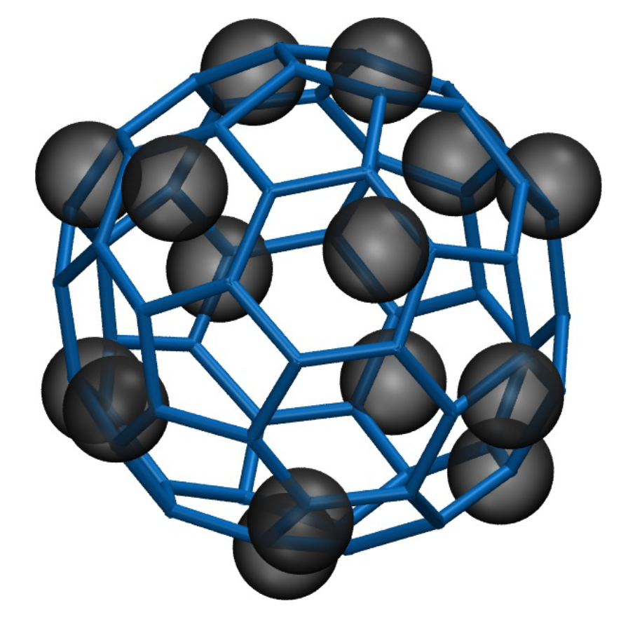

# Martini 3 model of Fullerene
<p align="center">

</p>

Generates a Martini 3 model of Fullerene for running the molecular dynamics simulation with the Gromacs simulation package. The script outputs both the structure file (.gro) and a topology file (.itp).


## Building the model


## Requirements

Python 3 with packages argparse, math, sys, numpy, MDAnalysis. The requirements can be found in requirements.txt.

## Usage

For generating the structure and topology of a fullerene, run
 ```
 python build_fullerene.py -np [number of beads] \
                                         -b [bead type] \
                                         -r [radius of sphere in nm]
                                         -n [Name of the molecule] \
 ```                                  

for example

    python build_fullerene.py -np 15 -b SC5r -r 0.365 -n F15

All arguments are optional. If an argument is not used, the default value for the number of beads (15), bead type (SC5r) and the name of the molecule (F15) is used.


## Solid state properties

The repository also contains all the tools required to reproduce the solid state properties; enthalpy of sublimation and lattice constant which is used to validate the model. The tools are available inside the folder solid_state_properties.

### Enthalpy of sublimation

The associated MDPs for running simulations of both solid and vapor phase can be found inside MDPs folder. Bash script in get_fcc.awk can be used to build a FCC crystal of the input structure, which by default should be called input.gro
For generating the structure and topology of a fullerene, run
 ```
 bash get_fcc.awk [dimension of box in x in nm] [dimension of box in y in nm] [dimension of box in z in nm] [lattice_parameter]

 ```   
 for example

    bash get_fcc.awk 4 4 1.417                              
Also, the bash script enthalpy.sh is available to compute the enthalpy of sublimation. It outputs enthalpy.txt which contains the time series of enthalpy of sublimation.

### Lattice parameter

The bash script lattice.sh inside lattice_parameter computes the lattice parameter of the crystal.


## Citation

If the script or the model is helpful, please cite:
- [1] Shrestha R, Alessandri R, Vögele M, Souza P, Marrink S-J, Monticelli L. Martini 3 coarse-grained models for carbon nanomaterials. ChemRxiv. 2024; doi:10.26434/chemrxiv-2024-6s1wj  This content is a preprint and has not been peer-reviewed.


