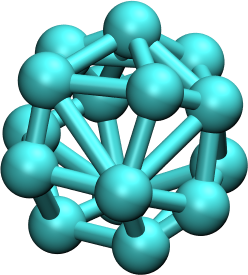

# Martini 3 model of Fullerene
<p align="center">

</p>

Generates a Martini 3 model of Fullerene for running the molecular dynamics simulation with the Gromacs simulation package. The script outputs both the structure file (.gro) and a topology file (.itp).


## Requirements

Python 3 with packages argparse, math, sys, numpy, MDAnalysis. The requirements can be found in requirements.txt.

## Usage

For generating the structure and topology of a fullerene, run
 ```
 python build_fullerene.py -np [number of beads] \
                                         -b [bead type] \
                                         -r [radius of sphere in nm]
                                         -n [Name of the molecule] \
 ```                                  

for example

    python build_fullerene.py -np 15 -b SC5r -r 0.365 -n F15

All arguments are optional. If an argument is not used, the default value for the number of beads (15), bead type (SC5r) and the name of the molecule (F15) is used.


## Notes

* The repository also contains all the tools required to reproduce the enthalpies of adsorption which is used to validate the model. 
* Following the parametrization of graphene, we have also developed the Martini 3 model of graphene oxide. The script can be found here.

## Literature

If the script or the model is helpful, please cite:


